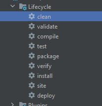
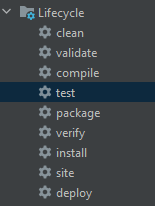
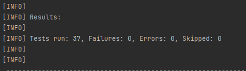
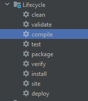
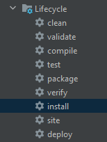
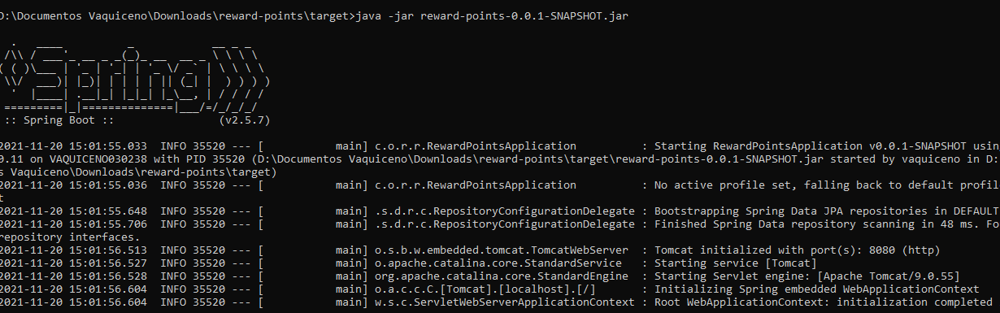
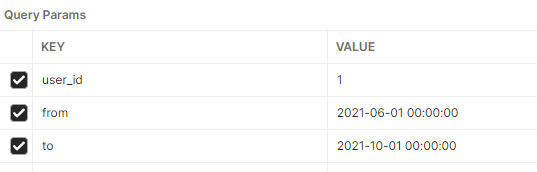
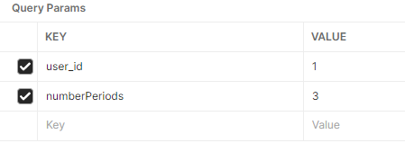

# reward-points

## Test and Compile

This project was built using maven.

please first clean the project



then execute all unit test





then compile



## Run

To run the project, just execute install task



and then go to the .jar generated folder and execute it from console using java -jar command



or you can just execute it from your favorite IDE.

# DataSet

We use a H2 database in this project, we have two tables, transaction and user.
in data.sql you can find the initial dataset.

# Apis
Here you can find a Collection of api endpoints calls in Postman:
https://www.getpostman.com/collections/5d5b43be49f823c752ee

## Transaction Api:

### All (GET)
endpoint: http://localhost:8080/api/v1/transaction/all

returns all transaction in database:

example output:

```json
[
  {
    "id": 1,
    "value": 150,
    "created": "2021-11-10T21:09:21.773+00:00",
    "user": 1
  },
  {
    "id": 2,
    "value": 100,
    "created": "2021-10-31T21:09:21.821+00:00",
    "user": 1
  }
]
```

### Add (POST)
endpoint: http://localhost:8080/api/v1/transaction/add

save a transaction in database:

example input:
body:
```json
{
  "value": 90,
  "created": "2021-01-23T22:29:11.944+00:00",
  "user": {
    "id": 1,
    "name": "pep1"
  }
}
```

example output:
```json
{
  "id": 25,
  "value": 90,
  "created": "2021-01-23T22:29:11.944+00:00",
  "user": 1
}
```

### Update (PUT)
endpoint: http://localhost:8080/api/v1/transaction/update

update a transaction in database:

example input:
body:
```json
{
    "id": 1,
    "value": 100,
    "created": "2021-03-23T22:29:11.944+00:00",
    "user": {
        "id": 2
    }
}
```

example output:
```json
{
    "id": 1,
    "value": 100,
    "created": "2021-03-23T22:29:11.944+00:00",
    "user": 2
}
```
## User Api:

### All (GET)
endpoint: http://localhost:8080/api/v1/user/all

Get all users in database:

example output:
```json
[
    {
        "id": 1,
        "name": "pep1",
        "transactions": [
            {
                "id": 2,
                "value": 100,
                "created": "2021-10-31T21:09:21.821+00:00"
            },
            {
                "id": 3,
                "value": 80,
                "created": "2021-10-21T21:09:21.822+00:00"
            }
        ]
    },
    {
        "id": 2,
        "name": "pep2",
        "transactions": [
            {
                "id": 1,
                "value": 100,
                "created": "2021-03-23T22:29:11.944+00:00"
            },
            {
                "id": 13,
                "value": 200,
                "created": "2021-11-10T21:09:21.839+00:00"
            }
        ]
    }
]
```

### Add (POST)
endpoint: http://localhost:8080/api/v1/user/add

save a user in database:

example input:
body:
```json
{
    "name": "pep3"
}
```

example output:
```json
{
    "id": 3,
    "name": "pep3",
    "transactions": null
}
```

### Update (PUT)
endpoint: http://localhost:8080/api/v1/user/update

update a user in database:

example input:
body:
```json
{
    "id": 1,
    "name": "pepnuevo"
}
```

example output:
```json
{
    "id": 1,
    "name": "pepnuevo",
    "transactions": null
}
```

### rewardUser (GET)
endpoint: http://localhost:8080/api/v1/user/rewardUser

calculate reward points for a user between two dates:

example input:
params:




example output:
```json
900
```

### rewardUserLastMonths (GET)
endpoint: http://localhost:8080/api/v1/user/rewardUserLastMonths

calculate reward points for a user given a number of periods. 
Calculation start from current month and go back the number of months
as indicated in the parameter number of periods (in the exercise this parameter should be 3):

example input:
params:



example output:
```json
{
  "total": 840,
  "year-month": {
    "2021-09": 810,
    "2021-10": 30,
    "2021-11": 0
  }
}
```

